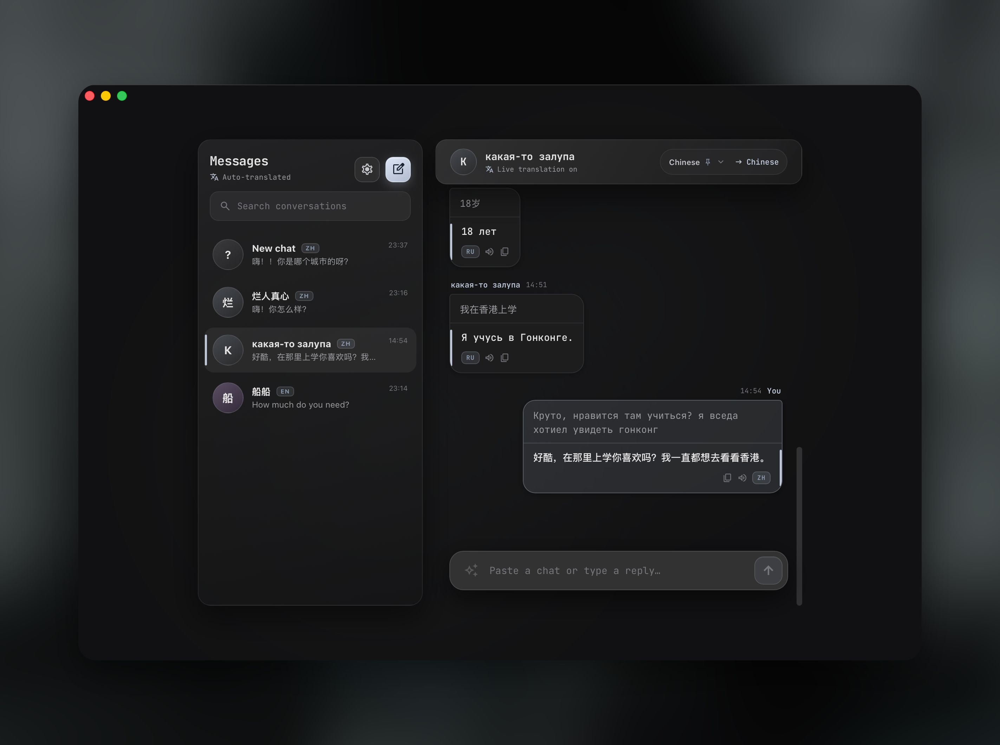

<h1 align="center">TrchSync</h1>

<p align="center">
  <b>A desktop chat-translation assistant.</b><br/>
  Paste or type a conversation — every message is auto-translated into your language in real time,
  with context-aware wording and AI reply suggestions.
</p>

<p align="center">
  
  
  
  
  
</p>

---

## Preview

<p align="center">
  
</p>

<p align="center"><sub>Two-pane desktop: conversation list on the left, a live-translated chat on the right — frosted-glass UI, native macOS overlay title bar.</sub></p>

---

## What it is

TrchSync is a **Tauri + SolidJS desktop app** for chatting across languages. You paste a chat log
(or type messages); it parses them into a conversation, translates each line into your **target
language**, and offers short **reply suggestions** you can send back. Translation is powered by the
**OpenAI Codex `app-server`** running locally on your machine — TrchSync just drives it.

## Features

- 🌍 **Real-time translation** of both incoming and outgoing messages into your target language.
- 🧠 **Context-aware** — recent conversation history (bounded) is sent so tone, pronouns and
  references carry across the chat, without ever changing the output language.
- 📋 **Paste-a-log → batch translate** — a pasted conversation is parsed into messages and
  translated in a **single** Codex turn (one round-trip, not one per line).
- 🔤 **Per-chat language auto-detect** (CJK / Cyrillic / Latin heuristics) with a manual
  interlocutor-language lock.
- 💬 **AI reply suggestions** — up to 3 short, distinct replies to an incoming message.
- 🧵 **Per-chat Codex threads** — each conversation is isolated and keeps Codex's prompt cache
  warm (≈5s warm turns vs ≈30s cold).
- 💾 **Local persistence** — settings and chats are stored as JSON in the OS app-config dir.
- 🖱️ **Click-to-copy** translations with toast notifications.
- 🪟 **Native-feel UI** — frosted glass, macOS traffic-lights overlay title bar, draggable
  background; graceful fallback when Codex isn't installed.

## How it works

```
┌──────────────────────────────┐   invoke    ┌─────────────────────────────┐
│  SolidJS frontend (WebView)  │ ──────────► │   Rust backend (Tauri 2)    │
│  parse → translate → render  │ ◄────────── │   CodexManager + commands   │
└──────────────────────────────┘   result    └──────────────┬──────────────┘
     copy · toast · suggestions                              │ JSON-RPC 2.0 over stdio
                                                             ▼
                                             ┌─────────────────────────────┐
                                             │   codex app-server (OpenAI) │
                                             │ per-chat thread · warm cache │
                                             └─────────────────────────────┘
```

**Frontend (`frontend/src`, SolidJS + Vite + Bun)**
- `parse.ts` turns the textarea text into a list of messages (`name: text`), idempotently — the
  text is the single source of truth, so re-parsing on every keystroke never duplicates messages.
- `translate.ts` resolves each message in order: **local dictionary → Codex (`translate` /
  `translate_batch`) → `window.claude` (browser-dev only) → echo the source** on failure.
- `App.tsx` owns chats, messages, the frosted UI, copy/toast, and language detection.

**Backend (`src`, Rust + Tauri 2 + tokio)**
- `codex.rs` spawns **one long-lived `codex app-server`** and speaks JSON-RPC 2.0 over its stdio
  (`initialize → thread/start → turn/start → …`).
- Each chat gets **its own thread** (keyed by chat id) so contexts never bleed between chats and
  the prompt cache stays warm. Threads recycle every **20 turns**; at most **24** live threads;
  history fed back as context is capped at **12 messages / 1600 chars**.
- `lib.rs` exposes the Tauri commands and manages the shared Codex client (a dead turn drops the
  client so the next request reconnects).

**Translation request lifecycle**

1. UI parses the pasted/typed text into messages and decides each one's direction
   (your messages → interlocutor's language; their messages → your target language).
2. Messages are sent to the Rust `translate` / `translate_batch` command with recent history.
3. Rust runs a turn on that chat's warm Codex thread and streams back the result.
4. For incoming messages, `suggest_replies` returns up to 3 replies via a structured JSON schema.

## Supported models

Translation is delegated to the **OpenAI Codex CLI** (`codex app-server`), so TrchSync runs on
**whatever model your Codex install is configured and authenticated to use** — it does not hardcode
or pick a model itself. Batch translation and reply suggestions request **structured JSON output**
(`outputSchema`) so results parse reliably.

Requirements:
- The `codex` binary installed and authenticated. TrchSync auto-detects it via `CODEX_BIN`, then
  `PATH`, then common install dirs (Homebrew, `~/.local/bin`, `~/.cargo/bin`, `~/.bun/bin`, …).
- No translation engine? The UI still runs and simply echoes the source text (and the dictionary
  demo entries still resolve).

## Tauri command API

The frontend talks to Rust via `invoke(...)`:

| Command            | Purpose                                                        |
| ------------------ | ------------------------------------------------------------- |
| `translate`        | Translate one message into a target language (with history).  |
| `translate_batch`  | Translate many messages in a single Codex turn (ordered).     |
| `suggest_replies`  | Up to 3 short replies to an incoming message.                 |
| `load_settings` / `save_settings` | Persist `targetLang` + `selfNames`.            |
| `load_chats` / `save_chats`       | Persist conversations + messages (`chats.json`).|
| `codex_available`  | Whether a `codex` binary was detected on this machine.        |

```ts
import { invoke } from '@tauri-apps/api/core';

const translated = await invoke<string>('translate', {
  chatId: 'alice',
  text: '你好，最近怎么样？',
  targetLang: 'English',
  history: [{ speaker: 'Me', text: 'Hey!' }],
});
```

## Tech stack

- **Tauri 2** — Rust (edition 2024), tokio (multi-thread runtime, process, io, sync, time).
- **SolidJS 1.9** + **Vite 7** + **TypeScript**, packaged with **Bun**.
- **OpenAI Codex `app-server`** — JSON-RPC 2.0 over stdio.

## Getting started

**Prerequisites:** [Rust](https://rustup.rs), [Bun](https://bun.sh), and the
[`codex`](https://developers.openai.com/codex) CLI (installed + authenticated) for live translation.

```bash
# install deps (root + frontend)
bun install
bun install --cwd frontend

# run the desktop app in dev (builds Rust, starts the Vite frontend, opens the window)
bunx tauri dev

# production build
bunx tauri build
```

> The Vite dev server (`http://localhost:3000`) and the production build are wired through
> `tauri.conf.json` (`beforeDevCommand` / `beforeBuildCommand`), so the commands above are all
> you need.

### Configuration

- **`CODEX_BIN`** — absolute path to the `codex` binary if it isn't on `PATH`.
- **Data location** — settings + chats are stored in the app config dir, e.g. on macOS
  `~/Library/Application Support/com.trchsync.app/{settings.json,chats.json}`.

## Project structure

```
trch/
├── src/                 # Rust backend (Tauri)
│   ├── lib.rs           #   commands + CodexManager (shared client, lifecycle)
│   ├── codex.rs         #   codex app-server driver (JSON-RPC, per-chat threads)
│   └── settings.rs      #   settings load/save
├── frontend/            # SolidJS app (Vite + Bun)
│   └── src/
│       ├── App.tsx      #   desktop UI (chats, messages, frosted UI, toasts)
│       ├── Mobile.tsx   #   compact /mobile layout
│       ├── translate.ts #   translation + language helpers (invoke bridge)
│       ├── parse.ts     #   chat-log parser
│       └── settings.ts  #   settings/chats persistence bridge
├── capabilities/        # Tauri permissions
├── tauri.conf.json      # window + bundle config
└── docs/                # README assets
```

## Status

Personal project, macOS-focused (the overlay title bar + frosted UI are tuned for WKWebView on
macOS). Translation quality depends entirely on the model your Codex CLI is wired to.
